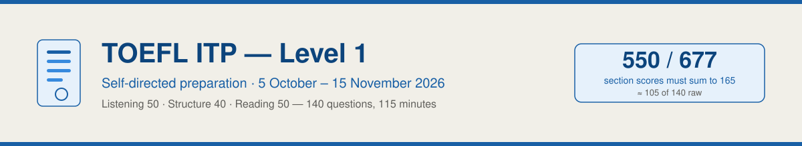

# TOEFL ITP Preparation — Level 1



## 1. Profile

1. **Name:** sanishiho23
2. **GitHub:** [github.com/sanishiho23](https://github.com/sanishiho23)
3. **Programme:** TOEFL ITP Level 1 — self-directed preparation
4. **Administering institution:** _(fill in — the body that runs your test date)_
5. **Target score:** 550 / 677
6. **Weakest section:** Structure & Written Expression (40 questions / 25 minutes)
7. **Daily budget:** 1.5–2 hours
8. **Period:** 5 October – 15 November 2026 (6 weeks / 42 days)
9. **Target test date:** Saturday 14 November 2026 ⚠️ _replace with your confirmed date_
10. **Accountability partner:** _(optional — see the [support plan](<./support/learning-support-plan.md>))_

## 2. End of Program Report

### 1. Study plan and curriculum

- [ ] [Study plan with weekly deadlines](<./docs/Goals-Summary.md>)
- [ ] [Week 00 — diagnostic and structure bootcamp](<./docs/curriculum/week-00.md>)
- [ ] [Week 01 — structure deep dive](<./docs/curriculum/week-01.md>)
- [ ] [Week 02 — reading comprehension](<./docs/curriculum/week-02.md>)
- [ ] [Week 03 — listening comprehension and mock 1](<./docs/curriculum/week-03.md>)
- [ ] [Week 04 — integration and mock 2](<./docs/curriculum/week-04.md>)
- [ ] [Week 05 — taper and exam](<./docs/curriculum/week-05.md>)

### 2. Study notes

Structure & Written Expression (priority)

- [ ] [S01 — Subject-verb agreement and word order](<./docs/study-notes/structure/[06-Oct] S01 - Subject-Verb Agreement.md>)
- [ ] [S02 — Verb tenses and time markers](<./docs/study-notes/structure/[07-Oct] S02 - Verb Tenses and Time Markers.md>)
- [ ] [S03 — Participles, gerunds and infinitives](<./docs/study-notes/structure/[09-Oct] S03 - Participles, Gerunds and Infinitives.md>)
- [ ] [S04 — Noun clauses and reported speech](<./docs/study-notes/structure/[12-Oct] S04 - Noun Clauses and Reported Speech.md>)
- [ ] [S05 — Adjective clauses and reductions](<./docs/study-notes/structure/[13-Oct] S05 - Adjective Clauses and Reductions.md>)
- [ ] [S06 — Adverb clauses and conditionals](<./docs/study-notes/structure/[14-Oct] S06 - Adverb Clauses and Conditionals.md>)
- [ ] [S07 — Inversion, comparatives and parallelism](<./docs/study-notes/structure/[15-Oct] S07 - Inversion, Comparatives and Parallelism.md>)
- [ ] [S08 — Word forms, articles and prepositions](<./docs/study-notes/structure/[16-Oct] S08 - Word Forms, Articles and Prepositions.md>)

Listening

- [ ] [L01 — Part A strategy](<./docs/study-notes/listening/[10-Oct] L01 - Part A Strategy.md>)
- [ ] [L02 — Idiom bank (120 items)](<./docs/study-notes/listening/[27-Oct] L02 - Idiom Bank.md>)
- [ ] [L03 — Parts B and C, note-taking](<./docs/study-notes/listening/[28-Oct] L03 - Parts B and C Note-taking.md>)
- [ ] [L04 — Audio script bank](<./docs/study-notes/listening/[24-Oct] L04 - Audio Script Bank.md>)

Reading and vocabulary

- [ ] [R01 — The 8 question types](<./docs/study-notes/reading/[19-Oct] R01 - Question Types.md>)
- [ ] [R02 — Vocabulary in context](<./docs/study-notes/reading/[20-Oct] R02 - Vocabulary in Context.md>)
- [ ] [R03 — Practice passages](<./docs/study-notes/reading/[21-Oct] R03 - Practice Passages.md>)
- [ ] [Academic word list (240 words)](<./docs/study-notes/vocabulary/[20-Oct] Academic Word List.md>)
- [ ] [Word families](<./docs/study-notes/vocabulary/[16-Oct] Word Families.md>)

Reference

- [ ] [Score conversion](<./docs/study-notes/reference/Score Conversion.md>)
- [ ] [Test day playbook](<./docs/study-notes/reference/Test Day Playbook.md>)
- [ ] [Timing and guessing](<./docs/study-notes/reference/Timing and Guessing.md>)
- [ ] [External resources](<./docs/study-notes/reference/Resources.md>)

### 3. Hands-on (tests and drills)

- [ ] [Diagnostic test — 30 questions](<./docs/hands-on/[05-Oct] Diagnostic Test.md>)
- [ ] [Structure test 01 — 40 questions / 25 min](<./docs/hands-on/[17-Oct] Structure Test 01.md>)
- [ ] [Reading test 01 — 25 questions / 28 min](<./docs/hands-on/[23-Oct] Reading Test 01.md>)
- [ ] [Listening test 01 — 20 questions, script-based](<./docs/hands-on/[29-Oct] Listening Test 01.md>)
- [ ] [Mock exam protocol](<./docs/hands-on/[31-Oct] Mock Exam Protocol.md>)
- [ ] Mock exam 1 run (day 27, estimated total ≥ 520)
- [ ] Mock exam 2 run (day 32, estimated total ≥ 545)

### 4. Logs

- [ ] [Daily logs — 42 entries](<./docs/logs/daily/README.md>)
- [ ] [Weekly reports](<./docs/logs/weekly/>)
- [ ] [Master journal (Daily-Logs.md)](<./Daily-Logs.md>)
- [ ] [Score tracker](<./progress/score-tracker.md>)
- [ ] [Error log](<./progress/error-log.md>)
- [ ] [Important dates](<./docs/logs/Important Dates.md>)

### 5. Final result

- [ ] Official score recorded in the [score tracker](<./progress/score-tracker.md>)
- [ ] Retro entry written on [day 42](<./docs/logs/daily/week-05/15-11-2026.md>)
- [ ] Final push to `origin/main`

## 3. Repository map

| Path | Contents |
|---|---|
| `Daily-Logs.md` | master journal, reverse chronological, weekly blocks |
| `docs/Goals-Summary.md` | the study plan — weekly objectives, topics, deadlines |
| `docs/curriculum/` | 6 week plans, each holding 7 daily lesson plans |
| `docs/study-notes/` | grammar, listening, reading, vocabulary, reference |
| `docs/hands-on/` | practice tests and the mock exam protocol |
| `docs/logs/daily/week-NN/` | 42 daily entries, `DD-MM-YYYY.md` |
| `docs/logs/weekly/` | weekly reports |
| `docs/meetings/` | check-ins with the accountability partner |
| `progress/` | score tracker and error log |
| `support/` | study-access plan, goals and review table |
| `tools/` | daily-log generator |
| `assets/` | banner |

## 4. What the test actually is

Source: [ETS — TOEFL ITP Test Content](https://www.ets.org/toefl/itp/test-content.html) (official).

| Section | Questions | Time | Scaled score | On the day |
|---|---:|---:|---:|---|
| Listening Comprehension | 50 | 35 min | 31–68 | Audio plays **once**. No replays. |
| Structure & Written Expression | 40 | 25 min | 31–68 | ~15 fill-in-the-blank + ~25 error-finding |
| Reading Comprehension | 50 | 55 min | 31–67 | 5–6 passages, ~10 questions each |
| **TOTAL** | **140** | **115 min** | **310–677** | Paper or digital, all multiple choice |

**Score arithmetic (exact):** `Total = round((Listening + Structure + Reading) × 10 / 3)`.
So **550 needs the three section scores to add to 165** — e.g. L 54 + S 57 + R 54.

Working raw estimate for 550 (⚠️ estimate, not the official ETS table): Structure 32/40,
Listening 38/50, Reading 35/50 → **≈ 105 / 140 (75%)**.
See [Score Conversion](<./docs/study-notes/reference/Score Conversion.md>).

## 5. Official practice from ETS (free)

- [ETS — TOEFL ITP Preparation](https://www.ets.org/toefl/itp/prepare.html)
- [Level 1 · Section 1 · Listening samples](https://toefl-samples.ets-rschtech-prod.c.ets.org/toefl_www/toefl_itp/test_preparation/sample_questions/level1_section1_listening_comprehension.html)
- [Level 1 · Section 2 · Structure samples](https://toefl-samples.ets-rschtech-prod.c.ets.org/toefl_www/toefl_itp/test_preparation/sample_questions/level1_section2_structure_written_expression.html)
- [Level 1 · Section 3 · Reading samples](https://toefl-samples.ets-rschtech-prod.c.ets.org/toefl_www/toefl_itp/test_preparation/sample_questions/level1_section3_reading_comprehension.html)

More free sources: [Resources](<./docs/study-notes/reference/Resources.md>)

## 6. Repo hygiene

```bash
git add -A
git commit -m "day NN: <section> drill <score>"
git push origin main
```

Every day gets a commit. The single commit that matters most is tomorrow's.
